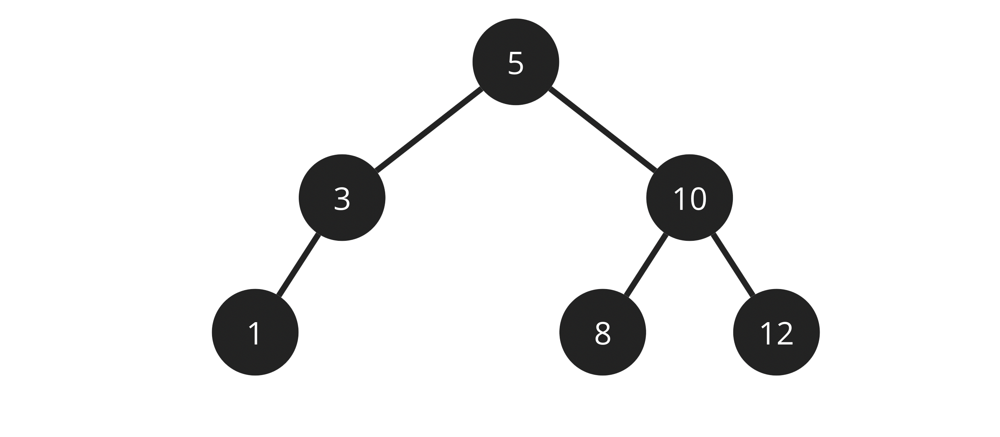

    

<h1 align="center">
    Binary Search Tree
</h1>

<h2 align="center">
    BTS implemantation in C
</h2>

    <!--  -->
    
    
    

 
 

<h2>Binary Search Trees in general</h2>
  

A binary search trees (BST) is a container that allows fast lookup, addition and removal of items, and can be used to implement either dynamic sets of items, or lookup tables that allow finding an item by its key (e.g., finding the phone number of a person by name).

  

<h2>About:</h2>
Evaluation Project for the Data Structure course from Big Data at IESB. 
  

This project implements in a working and optimal way a BTS using C as a programming language. 
  

